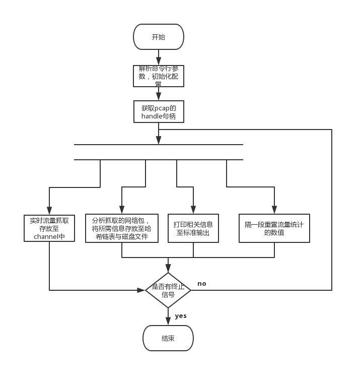

# 网络流量分析工具
## 运行维护
### 安装
> 配置好golang环境后先执行 go get github.com/google/gopacket 获取gopacket包，然后执行 go get github.com/whiskey-wei/network_analysis 获取项目源码，进入项目目录执行go build编译
### 使用
* 命令行选项
    * -h  
        查看命令行选项  
    * -d
        选择网卡接口，默认为en0  
    * -i  
        过滤的端口号，默认不过滤（即为0）
    * -p
        过滤的协议，只支持tcp与udp，默认不过滤  
    * -t  
        每隔t时间统计该时间段内，连接中数据包的大小，单位是s，默认为10s  
    * tp  
        tcp数据包的文件存储路径，默认为./info/tcpinfo  
    * dp  
        udp数据包的文件存储路径，默认为./info/udpinfo  

## 项目功能
* 实时抓取网络数据  
* 网络协议分析与显示  
* 将网络数据包聚合成数据流，以源 IP、目的 IP、源端口、目的端口及协议等五元组的形式存储
* 计算并显示固定时间间隔内网络连接

## 项目结构
* conf/conf.go  
  存储相关配置
* handlepacket
  * hashkey.go  
    计算哈希值  
  * hashlist.go  
    哈希表的增删操作  
  * info.go  
    对网络包的处理，包括提取相关信息，然后存储到哈希表和磁盘文件
  * model.go   
    用到的哈希存储模型

## 项目设计
* 数据结构
    * PacketInfo:	//数据包的存储模型  
		Protocol  		string 	//协议类型  
		State   		string	//TCP状态  
		SrcMAC   	net.HardwareAddr  
		DstMAC   	net.HardwareAddr  
		SrcIP     		net.IP  
		DstIP     		net.IP  
		SrcPort   		uint16  
		DstPort   		uint16  
		TimeStamp 	int64 	//时间戳  
		DataSize  	int   		//这个包的大小  
		Seq       		uint32  
		Ack       		uint32  
	
	* MapValue：	//哈希表中的值  
		List			list.List	//链表，节点内容为PacketInfo  
		PreSize		int	//上一个时间段总共的数据包大小  
		NowSize		int	//当前时间段的数据包大小  
    * BaseMap:		//哈希表  
		sync.Map		//标准库中线程安全的Map，存储的值为MapValue  
		Add(info *PacketInfo)	//添加数据包  
		Del(info *PacketInfo)	//删除  

## 总体流程
